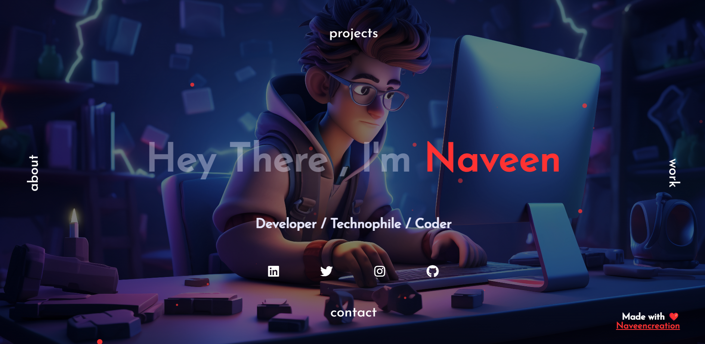
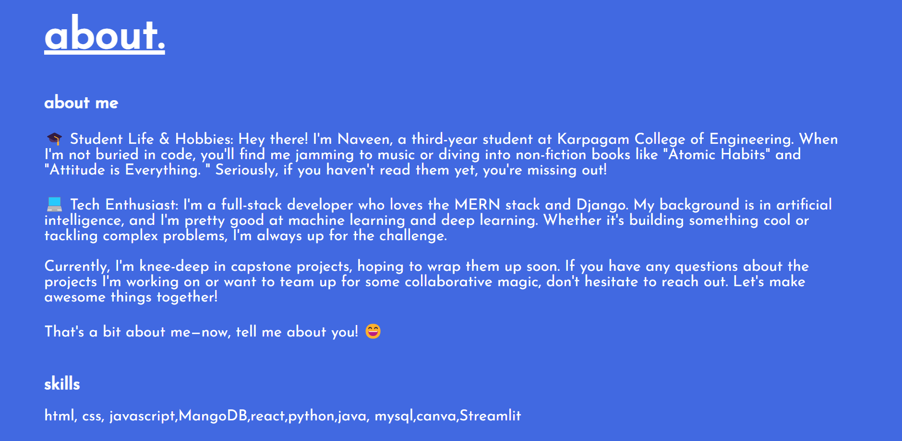
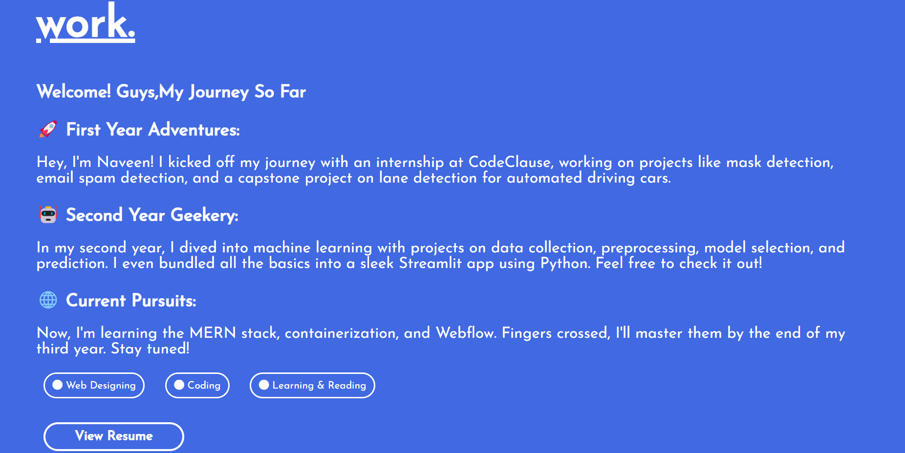
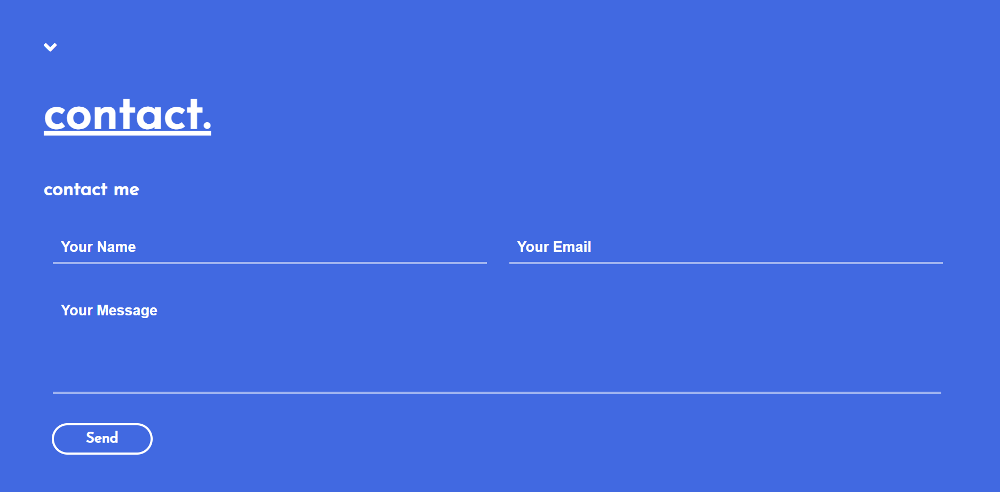

# My Portfolio Project

Hello guys! 👋 I am Naveen.

I have used only **HTML**, **CSS**, and **JavaScript** in this portfolio project. It's simple and quite good for a clean and straightforward appearance. I saw a similar template somewhere and decided to recreate it in my own way without using any fancy frameworks like React, Tailwind, or Bootstrap. I kept things as simple as possible.

Here is how it looks like:

## Screenshots

> This is all. If you like this, I also created a simple machine learning app you may check [here](https://github.com/naveencreation/Streamlit_MachinaMind).

Thank you for visiting! Feel free to reach out if you have any questions or feedback.

Goodbye! 👋
